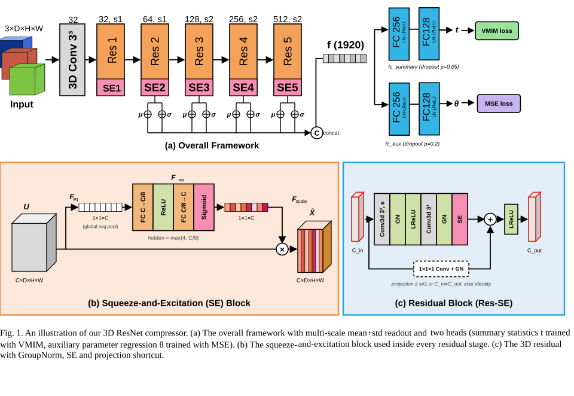
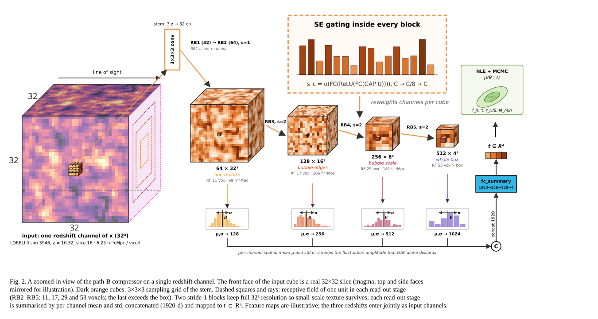
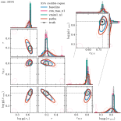

# 21cm-sbi-vmim

Simulation-based inference (SBI) pipeline for recovering astrophysical
parameters from 21cm lightcone cubes, comparing learned summary-statistic
compressors trained with **VMIM** (variational mutual information
maximization) against an **MSE**-trained baseline and a raw-summary
(no-compression) baseline.

The pipeline has four shared stages, run identically for every "arm" (CNN
cube compressor, MLP summary compressor, or raw baseline) so that comparisons
between them are fair:

```
Stage 1 (compress)   x -> t = F(x)              train/export the summary compressor
Stage 2 (NLE)        q(t | theta)                train a neural likelihood on t
Stage 3 (MCMC)       p(theta | t_obs)             SBC posterior sampling (stretch-move MCMC)
Stage 4 (eval)        --                          overplot/compare chains across arms
```

- **Stage 1 compressors**: a 3D residual CNN (`sbi/compressors`, cube inputs)
  or an MLP (summary-statistic inputs, e.g. PDF/power-spectrum), optionally
  trained with a VMIM head (`gmm_old`) or plain MSE regression.
- **Stage 2 NLE families**: `gmm` (mixture density network), `made`, `maf`,
  and `nsf` (neural spline flow) — all model `q(t | theta)`.
- **Stage 3 MCMC**: a shared stretch-move sampler with a wedge prior, used
  identically across arms for simulation-based calibration (SBC).
- **Stage 4 eval**: `.list`-file driven overplotting/metrics across any set
  of chain directories (see `sbi/example_lists.md`).

## Compressor architecture (path B: raw cubes)

The cube compressor (`ResNet3DCompressor`) takes the three redshifts as the
three input channels of one 3D image (`3 × 32³`). The default schedule is:

- a 3×3×3 stem with 32 channels;
- five residual blocks with squeeze-and-excitation gating, with channels
  32 → 64 → 128 → 256 → 512 and strides 1, 1, 2, 2, 2;
- a multi-scale readout: the per-channel spatial **mean and std** of blocks
  2–5 are concatenated into a 1920-d vector;
- two dense heads on that vector: `fc_summary` exports `t`, and `fc_aux`
  is the MSE regression head.

Two things are deliberate:

- **Late downsampling.** The two stride-1 blocks keep full resolution, so
  small-scale texture survives long enough to be encoded.
- **The std readout.** The std channels keep the fluctuation amplitude that
  global average pooling would discard.

Width, depth, strides and readout stages are configurable for ablations.
The defaults reproduce the 15.48M-parameter network.

**Overall framework.**



**Zoomed-in view on one redshift channel.** This is a toy view of how
compression propagates.

- **Input:** the front face of the input cube is a real 32×32 LORELI II
  slice (sim 3946, z = 10.32).
- **Dashed squares and rays:** the theoretical receptive field of a single
  unit in each readout stage, which is 11, 17, 29 and 53 voxels. They are
  *not* skip connections. Features pass through every block in sequence, and
  residual shortcuts act only within a block.



## Results

Representative posterior for one held-out simulation (68%/95% contours).
It compares the hand-crafted summaries (`PDF_PS`, path A) with the CNN
compressor on raw cubes (path B) under MSE and VMIM, with and without
dequantisation jitter. The true parameter values are shown as dashed lines.

<p align="center">
  
</p>

The table below gives results over 908 held-out SBC inferences at SKA 100 h
noise, all with the NSF likelihood.

| Compressor | Generalised variance (×10⁻⁹) | Calibration χ̂² (1 = ideal) |
|---|---|---|
| Hand-crafted PDF+PS, no compression (Semelin et al. 2025) | 48 | — |
| Path A: MLP + VMIM on PDF+PS | 141 | 1.65 – 2.50 |
| Path B: CNN + MSE | 6.7 | 1.14 – 1.45 |
| Path B: CNN + VMIM, jitter | **0.95** | **0.93 – 1.18** |

Learned compression on raw cubes tightens the joint posterior by about 50×
compared with the hand-crafted reference. VMIM stays within the calibration
tolerance (1 ± 0.26) on all four parameters, while MSE is mildly
over-confident. All results come from single training runs per
configuration.

## Repository layout

```
sbi/                  Core package: config loading, data loading, compressors,
                       NLE models, MCMC sampler, SBC validation plots
configs/               One YAML per arm (baseline_/, mlp_/, mse_/, vmim_/)
stage1_raw.py           Stage 1 for the no-compression baseline
stage1_compress.py      Stage 1: train + export a compressor's summaries
stage2_nle.py           Stage 2: train NLE model(s) on exported summaries
stage3_mcmc.py          Stage 3: SBC MCMC chains
stage4_eval.py          Stage 4: compare chains across arms
sbc_lists/              .list files for stage4 (which arms/chains to compare)
slurm/                  SLURM batch scripts for each stage (HPC cluster)
tools/                  Standalone plotting/diagnostic scripts
notebook/               Exploratory notebooks
docs/figures/           Architecture diagrams and result figures used in this README
```

## Installation

```bash
python -m venv .venv && source .venv/bin/activate
pip install -r requirements.txt
```

`tools/report_plots/figs_cubes.py` additionally needs `pyvista` for 3D cube
rendering (`pip install pyvista`); everything else only needs
`requirements.txt`.

## Usage

Each stage takes an arm config YAML (see `configs/`) and reads/writes to
`{scratch_root}/{arm_name}/` (set `scratch_root` in the config, or override
on the command line):

```bash
# Stage 1: train a compressor and export summaries (CNN or MLP arm)
python stage1_compress.py configs/vmim_/arm_cnn_vmim_n1.yaml
# ...or, for the no-compression baseline:
python stage1_raw.py configs/baseline_/baseline_pdf.yaml

# Stage 2: train one or more NLE families on the exported summaries
python stage2_nle.py configs/vmim_/arm_cnn_vmim_n1.yaml --models gmm,maf,nsf

# Stage 3: run SBC MCMC chains
python stage3_mcmc.py configs/vmim_/arm_cnn_vmim_n1.yaml

# Stage 4: compare arms
python stage4_eval.py --list sbc_lists/baseline.list --list sbc_lists/vmim_/... \
    --out eval_report --dlogp 10 --filtered-only
```

Any config value can be overridden from the command line with
`-o key.subkey=value`. See the docstring at the top of each `stageN_*.py`
file for stage-specific options, and `sbi/example_lists.md` for the
stage4 `.list` file format.

On the cluster this was developed on, each stage also has a matching
`slurm/stageN_*.sbatch` submission script.

**Note:** the example configs under `configs/` point at absolute paths on
the original HPC cluster (`/gscratch/...`, `/data/...`). Update `data.*`,
`scratch_root`, and the `nle`/`mcmc` `target_path` entries to your own paths
before running.

## Outputs

`sbc_out/`, `sbc_out_FULL/`, `logs/`, and `_tmp_renders/` are regenerated by
running the pipeline and are not tracked in git (see `.gitignore`).